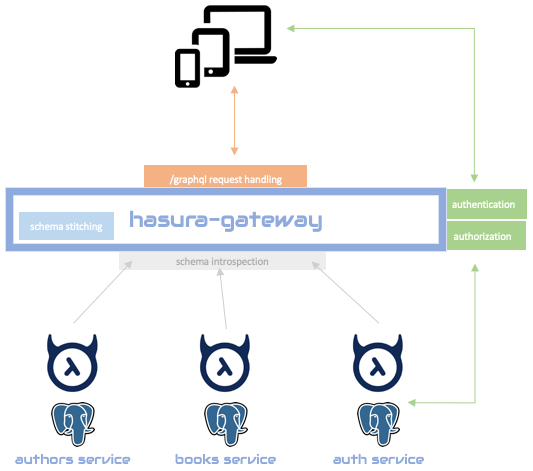

## Hasura Gateway
A proof-of-concept (and opinionated) GraphQL API gateway for [Hasura](https://hasura.io/) microservices.
> Inspired by [this blog post](https://blog.hasura.io/the-ultimate-guide-to-schema-stitching-in-graphql-f30178ac0072) the [Hasura examples](https://github.com/hasura/schema-stitching-examples).

#### Introduction
The Hasura Gateway is intended to create a single entry point from client applications (web apps, mobile apps, etc) into an ecosystem of [Hasura](https://hasura.io/) microservices.

The general architecture looks like this:



#### Concepts
Services, and their relationships are defined in the `/src/services.js` file:
```javascript
"use strict";

export const services = [
  {
    name: 'books',
    uri: process.env.SERVICE_BOOKS_URI,
    key: process.env.SERVICE_BOOKS_ACCESS_KEY,
    relatedServices: [
      {
        entity: 'books',
        entityField: 'author',
        linkingField: 'author_id',
        relatedService: 'authors',
        relatedEntity: 'authors',
        relatedField: 'id'
      }
    ]
  },
  {
    name: 'authors',
    uri: process.env.SERVICE_AUTHORS_URI,
    key: process.env.SERVICE_AUTHORS_ACCESS_KEY,
    relatedServices: [
      {
        entity: 'authors',
        entityField: 'books',
        linkingField: 'book_id',
        relatedService: 'books',
        relatedEntity: 'books',
        relatedField: 'id'
      }
    ]
  },
  {
    name: 'auth',
    uri: process.env.SERVICE_AUTH_URI,
    key: process.env.SERVICE_AUTH_ACCESS_KEY,
    authService: true
  }
];
```

#### Sample docker-compose
```Dockerfile
version: '3.6'
services:
  postgres:
    image: postgres
    restart: always
    volumes:
    - db_data:/var/lib/postgresql/data
    ports:
    - "5491:5432"
  edge-service:
    image: go4cas/hasura-gateway:latest
    ports:
    - "5000:4000"
    restart: always
    env_file: .env
  books-service:
    image: hasura/graphql-engine:v1.0.0-alpha34
    ports:
    - "8081:8080"
    depends_on:
    - "postgres"
    restart: always
    environment:
      HASURA_GRAPHQL_DATABASE_URL: ${SERVICE_BOOKS_DB_URL}
      HASURA_GRAPHQL_ACCESS_KEY: ${SERVICE_BOOKS_ACCESS_KEY}
    command:
      - graphql-engine
      - serve
      - --enable-console
  authors-service:
    image: hasura/graphql-engine:v1.0.0-alpha34
    ports:
    - "8082:8080"
    depends_on:
    - "postgres"
    restart: always
    environment:
      HASURA_GRAPHQL_DATABASE_URL: ${SERVICE_AUTHORS_DB_URL}
      HASURA_GRAPHQL_ACCESS_KEY: ${SERVICE_AUTHORS_ACCESS_KEY}
    command:
      - graphql-engine
      - serve
      - --enable-console
  auth-service:
    image: hasura/graphql-engine:v1.0.0-alpha34
    ports:
    - "8083:8080"
    depends_on:
    - "postgres"
    restart: always
    environment:
      HASURA_GRAPHQL_DATABASE_URL: ${SERVICE_AUTH_DB_URL}
      HASURA_GRAPHQL_ACCESS_KEY: ${SERVICE_AUTH_ACCESS_KEY}
    command:
      - graphql-engine
      - serve
      - --enable-console
```

#### To Do
- [ ] Test subscriptions
- [ ] Add ACL and set x-hasura-allowed-roles, x-hasura-default-role and x-hasura-user-id headers
- [ ] Move login, signin and validate to auth module
- [ ] Add refresh token, including token expiry, and persisting refresh tokens to db
